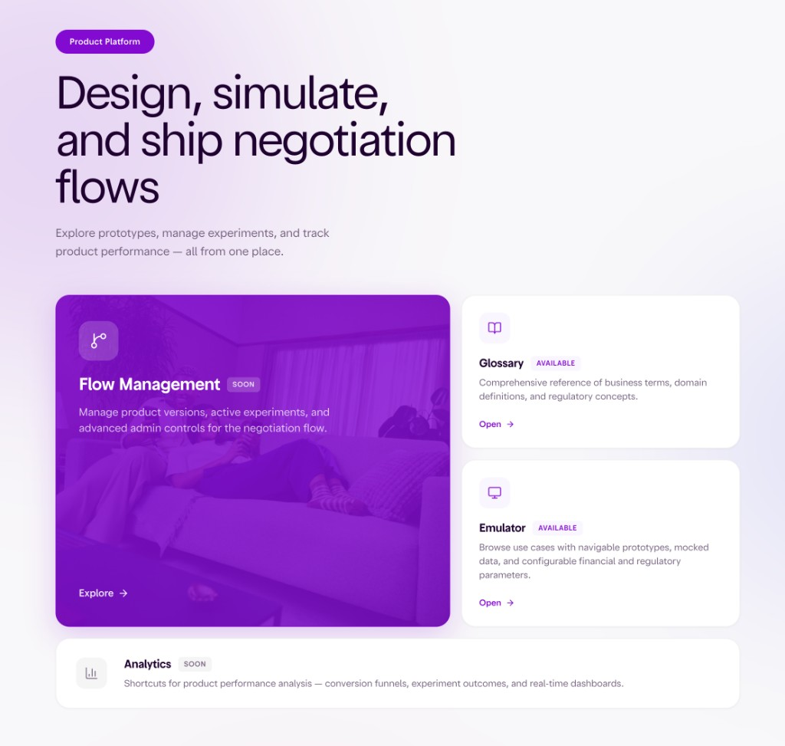

# Negotiation Flow Platform

Design, simulate, and ship negotiation flows — from prototype to production.

**Repository:** [github.com/julioferracini/design-negotiation-flow-emulator](https://github.com/julioferracini/design-negotiation-flow-emulator)

**Web Demo:** [julioferracini.github.io/design-negotiation-flow-emulator](https://julioferracini.github.io/design-negotiation-flow-emulator/)

**Contact:** [Julio Ferracini on Slack](https://nubank.enterprise.slack.com/team/U074WLC2SJG)



---

## Platforms

| Platform | Stack | Purpose |
|----------|-------|---------|
| **Expo Go** | React Native + NuDS | Mobile prototype — real device testing |
| **Web Emulator** | Vite + React + NuDS Web Adapter | Desktop prototype — split-screen with config panel |
| **GitHub Pages** | Static deploy | Public demo — auto-deployed from `develop` |

### Running locally

```bash
# Expo Go (mobile)
npm install
npx expo start

# Web Emulator (desktop)
cd web && npm install && npm run dev
```

---

## Information Architecture

```
Home
├── Glossary
├── Flow Management (soon)
├── Emulator
│   ├── NuDS Theme (Standard / UV / PJ × Light / Dark)
│   ├── Country / Language (pt-BR, es-MX, es-CO, en-US)
│   ├── Product Line → Use Case → Flow Parameters
│   ├── Financial Rules (Amortization, Values, Installments, Interest, Discounts)
│   └── UI Building Blocks
│       ├── Negotiation Pack (8 screens)
│       └── System Pack (3 screens)
├── Experience Architecture
├── Project Timeline
├── AI Assistant (contextual per section)
└── Sidebar Navigation
```

---

## UI Building Blocks

### Negotiation Pack

Screens where users make decisions — offers, values, dates, and confirmation.

| Block | Purpose | Status | Platform |
|-------|---------|:------:|----------|
| **Offer Hub** | Centralize and compare debt resolution offers with personalized proposals | Done | Web + Expo |
| **Eligibility** | Qualification gate — filters who can access installment plans | Done | Web + Expo |
| **Input Value** | ATM-style numeric keypad for installment and downpayment amounts | Done | Web + Expo |
| **Simulation** | Interactive slider to explore payment scenarios with real-time calculation | Done | Web + Expo |
| **Suggested Conditions** | Present available plans and recommend the best fit | Done | Web + Expo |
| **Due Date** | Calendar to select payment dates with locale-aware business day rules | Done | Web + Expo |
| **Summary** | Consolidate every decision into an editable checkout view | Done | Web + Expo |
| **Terms & Conditions** | Scrollable legal copy with scroll-to-confirm interaction | Done | Web + Expo |

### System Pack

Infrastructure screens — authentication, processing, and completion.

| Block | Purpose | Status | Platform |
|-------|---------|:------:|----------|
| **PIN** | 4-digit confirmation code entry | Done | Expo |
| **Loading** | Progress animation during server processing | Done | Expo |
| **Feedback** | Success/error screen with next-step CTAs | Done | Expo |

---

## Product Catalog

### Debt Resolution

| Use Case | Markets |
|----------|---------|
| MDR – Multi-debt Renegotiation | BR, MX, CO, US |
| Late Lending – Short | BR, MX, CO, US |
| Late Lending – Long | BR, MX, CO, US |
| CC Long – Agreements | BR, MX, CO, US |
| FP – Fatura Parcelada | BR |
| RDP – Renegociação de Pendências | BR |

### Lending

| Use Case | Markets |
|----------|---------|
| INSS | BR, MX, CO, US |
| Private Payroll | BR, MX, CO, US |
| SIAPE | BR, MX, CO, US |
| Military | BR, MX, CO, US |
| Personal Loan | BR, MX, CO, US |

### Credit Card

| Use Case | Markets |
|----------|---------|
| Bill Installment | MX |
| Refinancing | CO |

---

## Architecture

### Scope Separation

The codebase separates **Platform** (the tool itself) from **Prototype** (UI Building Blocks):

| Scope | Pages | Styling | NuDS? |
|-------|-------|---------|:-----:|
| **Platform** | Home, Glossary, Experience Architecture, Timeline | `platform.css` BEM + `var(--nf-*)` | No |
| **Prototype** | All Building Block screens | `nuds/` adapter + `prototype.css` BEM | Yes |

### NuDS Integration

| Layer | Expo Go | Web |
|-------|---------|-----|
| **Tokens** | `@nubank/nuds-vibecode-tokens` | `@nubank/nuds-vibecode-tokens` |
| **Theme** | `useNuDSTheme()` | `useTheme().nuds` via `web/src/nuds/theme.ts` |
| **Components** | `@nubank/nuds-vibecode-react-native` | `web/src/nuds/components/` (NText, Badge, Button, TopBar, SectionTitle, Box) |
| **Extensions** | Inline styles | `web/src/styles/prototype.css` (`.nf-proto__*` BEM) |
| **CSS Vars** | N/A | `injectNuDSCSSVars()` on PrototypeViewport |

### Styling Hierarchy (NuDS-first)

1. **NuDS Token** — `theme.color.*`, `theme.spacing[N]`, `theme.radius.*`, `theme.typography.*`
2. **NuDS Component** — `<NText>`, `<Badge>`, `<Button>`, `<TopBar>`, `<BottomSheet>`, `<Box>`
3. **BEM CSS** — `.nf-proto__card`, `.nf-proto__slider`, `.nf-proto__keypad` (web only)
4. **Inline Style** — only for motion-driven or conditional values

### Dual-Platform Delivery

Every UI Building Block change must be delivered to **both** platforms simultaneously. This is enforced by:

- **Cursor Rule**: `.cursor/rules/ui-building-blocks.mdc`
- **Guide**: `docs/UI-BUILDING-BLOCKS-GUIDE.md`

### Folder Structure

```text
negotiation-flow-ui-beta/
├── App.tsx                    # Expo entry point
├── config/                    # Flows, use cases, financial calculator, formatters
├── i18n/                      # Translations (pure) + React hook
├── screens/                   # Expo prototype screens
├── shared/
│   ├── types/                 # Platform-agnostic types (ScreenVisibility, etc.)
│   ├── config/                # Product lines, use case registry
│   ├── data/                  # Glossary, screen variants, packs
│   ├── i18n/                  # Canonical locale files (pt-BR, en-US, es-MX, es-CO)
│   └── tokens/                # NuDS V3 design tokens
├── components/                # Expo shared components (ScreenTemplate, Shimmer)
├── web/
│   ├── src/
│   │   ├── screens/           # Web prototype screens
│   │   ├── nuds/              # NuDS web adapter (theme, tokens, components)
│   │   ├── styles/
│   │   │   ├── platform.css   # BEM for Platform pages
│   │   │   └── prototype.css  # BEM for Prototype screens
│   │   ├── components/        # Web layout (SplitScreen, Sidebar, ParameterPanel)
│   │   ├── context/           # ThemeContext, EmulatorConfigContext
│   │   └── index.css          # Global resets, fonts, safe-area
│   └── vite.config.ts
├── .cursor/rules/             # Cursor Rules (UI Building Blocks)
├── docs/                      # Guides and documentation
└── .github/workflows/         # CI: GitHub Pages deploy
```

### i18n System

| Module | Purpose | React dependency |
|--------|---------|:---:|
| `shared/i18n/` | Canonical locale files + types | No |
| `i18n/index.ts` | Re-exports + `useTranslation()` hook | Yes |

Supported locales: `pt-BR`, `es-MX`, `es-CO`, `en-US`

### Data Flow

1. Active locale picks UI text from `i18n/`
2. Active use case loads financial rules from `config/`
3. `EmulatorConfigContext` merges base rules + user overrides
4. Each screen combines text + calculated data and renders UI
5. Transitions animate between screens

---

## Documentation

| Document | Path | Purpose |
|----------|------|---------|
| UI Building Blocks Guide | `docs/UI-BUILDING-BLOCKS-GUIDE.md` | NuDS-first rules, dual-platform checklist |
| Video Script Guide | `docs/VIDEO-SCRIPT-GUIDE.md` | Demo video recording guide |
| Cursor Rule | `.cursor/rules/ui-building-blocks.mdc` | Auto-enforced NuDS + dual-platform rule |
